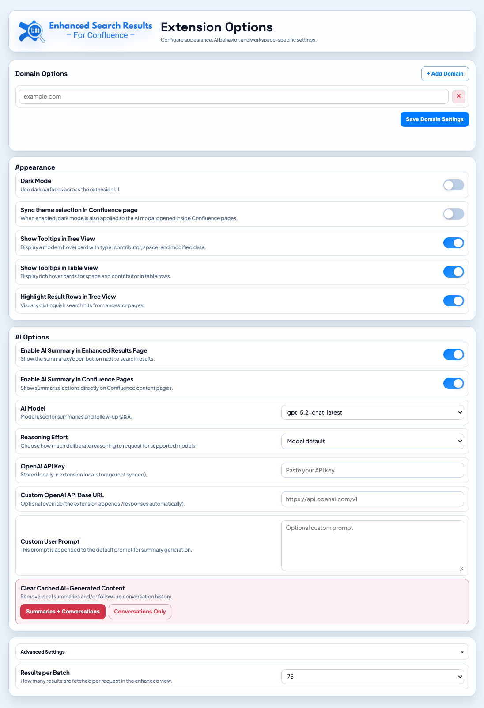
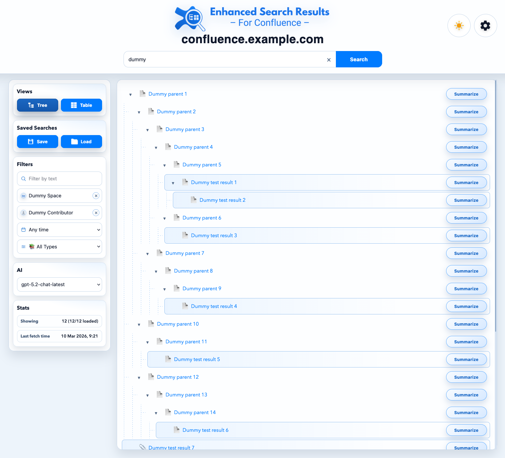
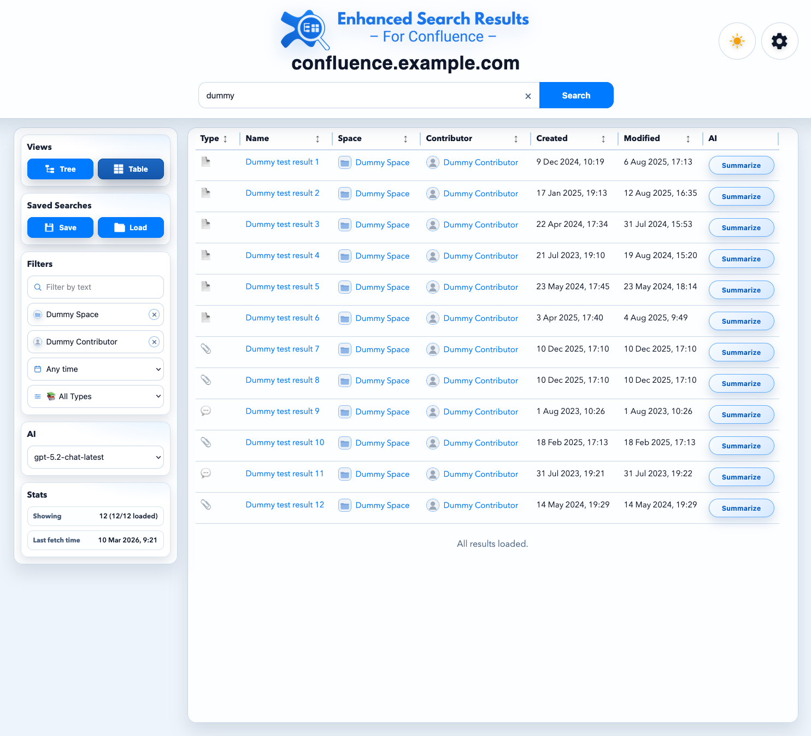

<p align="center">
  
</p>

# Enhanced Search Results for Confluence Extension

Enhance your Confluence experience with improved search functionality. This browser extension upgrades Confluence search results with richer navigation, filtering, and AI-assisted workflows on both Chrome and Firefox.

## Features

### 🧠 AI-Powered Features

- **Instant Page Summaries**  
  Get a quick overview of any Confluence page with one click. A floating "Summarize" button appears on supported pages to help you understand content faster — no need to scroll or skim.

- **Ask Follow-Up Questions**  
  Not sure about something? Use the built-in Q&A to ask questions about the page and get instant answers. Perfect for clarifying technical details, exploring related topics, or saving time.

- **Remembers Your Conversations**  
  The extension remembers your previous questions for each page, so you can pick up right where you left off.

- **Customizable AI Behavior**  
  Want the AI to focus on specific things? You can add a custom prompt in the options page to tailor summaries to your needs.

### 🔍 Views and Navigation

- **Tree View Navigation**:
  - Displays search results in a hierarchical tree structure reflecting parent-child page relationships.
  - Tooltips show title, type, contributor, and last modified date on hover.
  - Toggle collapse/expand of the entire tree by re-pressing the Tree button.
  - Refined tree visuals for better readability.

- **Table View with Sorting and Resizing**:
  - Clean and modernized table view with alternating row styles.
  - Sortable columns by clicking the header (Type, Name, Space, Contributor, Created/Modified dates).
  - Columns are resizable; double-click the resizer to reset to default width.

### 🧰 Filtering and Search Options

- **Advanced Filtering**:
  - **Text Filtering**: Narrow results by keywords in title or content.
  - **Space Filtering**: Filter by Confluence spaces.
  - **Contributor Filtering**: Filter by page contributors.
  - **Date Filtering**: Filter by last modified time (past day/week/month/year).
  - **Type Filtering**: Filter by type (Page, Blog Post, Attachment, Comment).

- **Batch Size Control** *(New!)*:
  - Configure how many results are fetched per scroll batch.

### 🌙 Display and Personalization

- **Dark Mode Support**: Toggle a dark theme for low-light environments.
- **Customizable Domains**: Configure multiple Confluence domains from the Options page.
- **New Icons and Branding**: Refreshed extension logo and interface icons for a polished experience.

### ⚡️ Performance & UX

- **Infinite Scrolling**: Automatically loads more results while scrolling.
- **Scroll-to-Top Button**: Instantly jump to the top of the results page.
- **Improved Runtime Performance** across both views.

## Installation

The extension is available on the Chrome Web Store and Firefox Add-ons site:

-  **[Chrome Web Store](https://chromewebstore.google.com/detail/enhanced-search-results-f/mmaihfkphcnjjheipeljfjbfkimfhcch)**
-  **[Firefox Add-ons](https://addons.mozilla.org/en-US/firefox/addon/enhanced-confluence-search/)**

## Development (Preact)

The UI is built with **Preact + Vite** from `ui/`.

### Prerequisites

- Node.js 18+ (recommended)
- npm

### Install dependencies

```bash
npm --prefix ui install
```

### Build extension assets

```bash
npm run build:ui
```

Build output folders:

- `.build/views` (enhanced search page bundle)
- `.build/options` (options page bundle)
- `.build/content` (content bootstrap bundle)

### Build unpacked distributables (`dist/`)

From repository root:

```bash
npm run build:dist
```

`build:dist` rebuilds UI assets first, then assembles browser-specific `dist/` folders.

This generates:

- `dist/chrome`
- `dist/firefox`

You can also build a single target:

```bash
npm run build:dist:chrome
npm run build:dist:firefox
```

Verify generated dist artifacts:

```bash
npm run verify:dist
```

Build and verify in one command:

```bash
npm run build:dist:checked
```

Optional for Firefox packaging:

- `FIREFOX_GECKO_ID` to override the default add-on ID (`enhancedconfluence@gmail.com`)
- `FIREFOX_STRICT_MIN_VERSION` to override minimum Firefox version (`102.0`)

### UI development server

```bash
npm --prefix ui run dev
```

Use this for UI iteration. For real extension testing, run `npm run build:dist`.

### Load unpacked extension locally

After running `npm run build:dist`:

1. **Chrome**
   - Open `chrome://extensions`
   - Enable **Developer mode**
   - Click **Load unpacked**
   - Select `dist/chrome`

2. **Firefox**
   - Open `about:debugging#/runtime/this-firefox`
   - Click **Load Temporary Add-on**
   - Select `dist/firefox/manifest.json`

### Project Structure

- `ui/` — Preact + Vite UI source (views page, options page, content modal app)
- `background/` — background runtime script source
- `extension/content/` — content bootstrap + content modal stylesheet source
- `shared/` — shared runtime modules used by background/content/UI runtimes
- `assets/` — icons/images/sounds
- `scripts/` — build/verification scripts for browser dist targets
- `.build/` — intermediate generated bundles from `ui/`
- `dist/chrome`, `dist/firefox` — packaged unpacked builds for each browser

## Usage

1. **Configure the Extension**:
   - Click the extension icon → **Options**
   - Add one or more Confluence domains
   - To enable AI-powered features:
     - Paste your **OpenAI API key** in the relevant field
     - (Optional) Provide a custom API endpoint if you're using a proxy or self-hosted service  
       Default: `https://api.openai.com/v1/`

     

2. **Search in Confluence**:
   - Open any configured Confluence domain
   - Use the floating extension launcher to open the enhanced search page
   - Enter your query in the enhanced search page to fetch Confluence results

3. **Browse and Filter**:
   - Use Tree or Table view
   - Apply filters as needed (spaces, contributors, date, type)
   - Use the search bar to refine your query further

     
     

## Configuration

### Domain Settings

Add one or more Confluence domains via the Options page (for example, `confluence.example.com`).

### Advanced Options

- **Results per Batch**: Configure how many results are loaded at once to balance performance and speed.
- **Dark Mode**: Toggle dark mode globally or per session.
- **Tooltips**: Enable/disable tooltips in Tree and Table views.
- **AI Settings**: Configure model, reasoning effort, API key, custom endpoint, and custom summarization prompt.

## Contributing

See [CONTRIBUTING.md](CONTRIBUTING.md) for contribution workflow and smoke-test checklist.

## License

This project is licensed under the [MIT License](LICENSE).

## Acknowledgements

- Built during the **ImpactOn Hackathon** in Ra'anana, Israel.
- Created to simplify and enhance navigation within Confluence search.
- Thanks to all contributors and the open-source community!

---

*Disclaimer: This extension is not affiliated with Atlassian or Confluence. It is an independent project intended to improve usability.*
