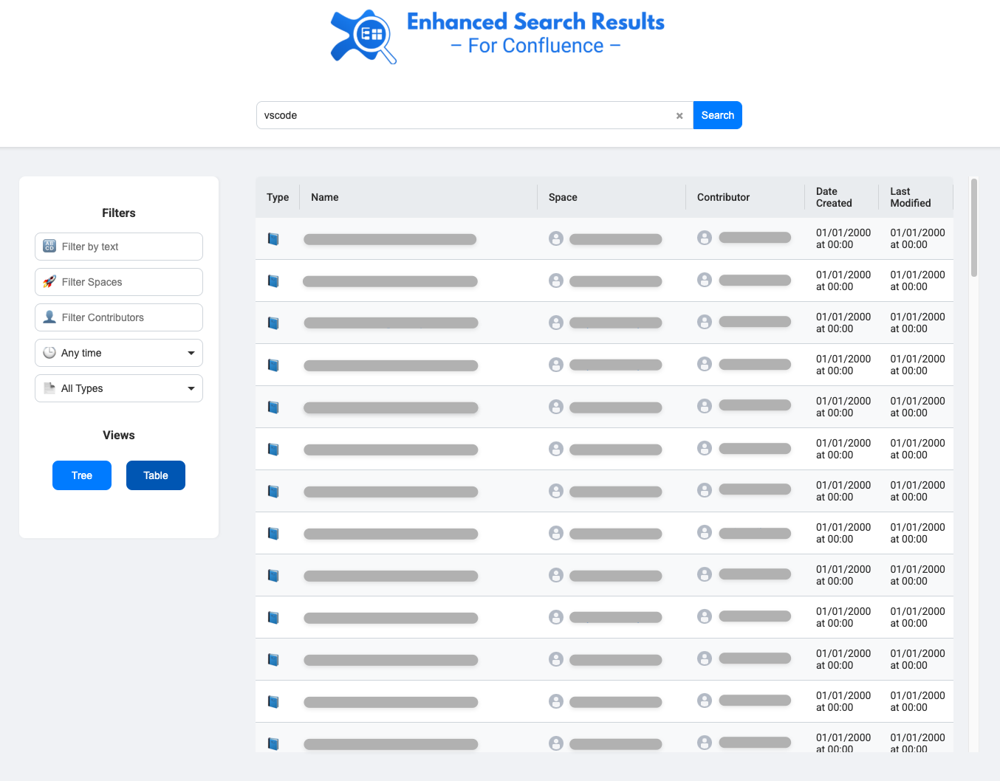

# Enhanced Search Results for Confluence Extension

Enhance your Confluence experience with improved search functionality! This browser extension enhances the way search results are displayed in Confluence, making it easier to navigate and find relevant information efficiently.

## Features

- **Tree View Navigation**: Displays search results in a hierarchical tree structure, reflecting the parent-child relationships between pages.
- **Table View with Sorting**: Provides a tabular view of search results with sortable columns such as Page Name, Space, Contributor, Date Created, and Last Modified.
- **Advanced Filtering**:
  - **Text Filtering**: Filter results based on specific text queries.
  - **Space Filtering**: Filter results by Confluence spaces.
  - **Contributor Filtering**: Filter results by page contributors or authors.
- **Dark Mode Support**: Toggle dark mode for a better viewing experience in low-light environments.
- **Infinite Scrolling**: Seamlessly load more results as you scroll down.
- **Scroll-to-Top Button**: Quickly return to the top of the search results page.
- **Customizable for Multiple Confluence Instances**: Supports different domains and search input element IDs for compatibility with various Confluence versions.

## Installation

1. **Clone or Download the Repository**:

   ```bash
   git clone https://gitlab.gpu.arm.com/Almog.Tzabary/enhanced-confluence-search-results.git
   ```

2. **Load the Extension in Your Browser**:

   - **For Chrome**:
     1. Open `chrome://extensions/` in your browser.
     2. Enable **Developer mode** by toggling the switch in the top right corner.
     3. Click on **Load unpacked** and select the directory where you cloned the repository.

   - **For Firefox**:
     1. Open `about:debugging#/runtime/this-firefox` in your browser.
     2. Click on **Load Temporary Add-on...** and select the `manifest.json` file from the cloned repository.

## Usage

1. **Configure the Extension**:

   - Click on the extension icon in your browser toolbar and select **Options**.
   - Add your Confluence domain(s) and the corresponding search input element ID(s). Each domain may have a different search input ID depending on the Confluence version.

     

2. **Perform a Search in Confluence**:

   - Navigate to your Confluence site.
   - Enter your search query in the Confluence search box and press **Enter**.
   - The extension will open a new tab displaying the enhanced search results.

3. **Navigate and Filter Results**:

   - Use the **Tree View** to see results in a hierarchical structure.
   - Switch to **Table View** for a sortable list of results.
   - Apply filters for text, spaces, and contributors to narrow down results.
   - Toggle **Dark Mode** using the switch in the header.

     
     

## Configuration

- **Domains and Search Input IDs**:

  - In the **Options** page, you can add multiple domains and specify the search input element ID for each. This ensures compatibility with different Confluence setups.

    | Field                | Description                                              |
    | -------------------- | -------------------------------------------------------- |
    | **Domain**           | The domain of your Confluence instance (e.g., `confluence.example.com`). |
    | **Search Input ID**  | The HTML `id` attribute of the search input element in your Confluence site (default is `search-filter-input`). |

- **Dark Mode**:

  - Toggle dark mode in the extension's settings or directly on the search results page.

## Contributing

We welcome contributions from the community! If you'd like to contribute:

1. **Fork the Repository**: Click the **Fork** button at the top right of the repository page.

2. **Create a Branch**:

   ```bash
   git checkout -b feature/your-feature-name
   ```

3. **Commit Your Changes**:

   ```bash
   git commit -am 'Add some feature'
   ```

4. **Push to the Branch**:

   ```bash
   git push origin feature/your-feature-name
   ```

5. **Create a Pull Request**: Open a pull request on GitHub and describe your changes.

## License

This project is licensed under the [MIT License](LICENSE).

## Acknowledgements

- Developed during the **ImpactOn Hackathon** in Ra'anana, Israel.
- Inspired by the need for better search navigation within Confluence.
- Thanks to all contributors and the open-source community for their support.

---

*Note: This extension is not affiliated with or endorsed by Atlassian or Confluence. It is an independent project aimed at enhancing user experience when using Confluence.*