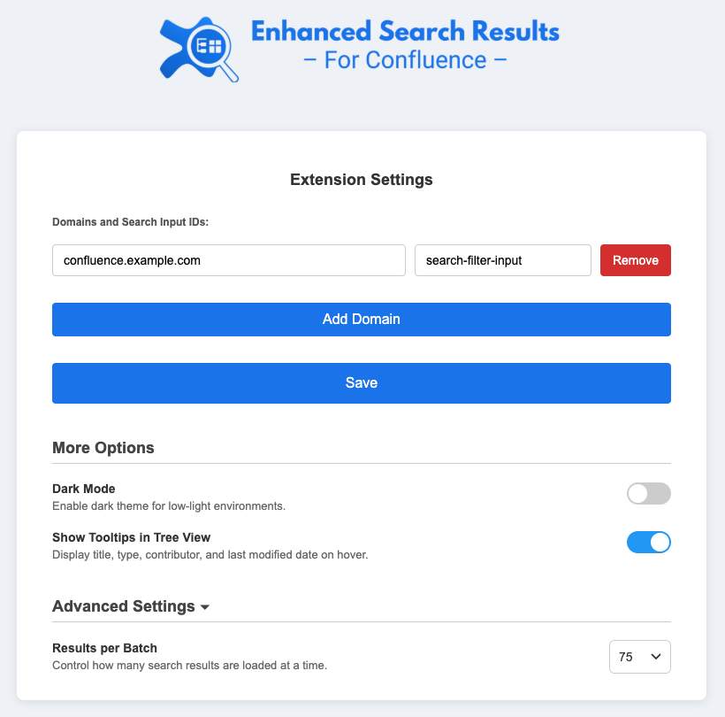

<p align="center">
  
</p>

# Enhanced Search Results for Confluence Extension

Enhance your Confluence experience with improved search functionality! This browser extension enhances the way search results are displayed in Confluence, making it easier to navigate and find relevant information efficiently.

## Features

### 🔍 Views and Navigation

- **Tree View Navigation**:
  - Displays search results in a hierarchical tree structure reflecting parent-child page relationships.
  - Tooltips show title, type, contributor, and last modified date on hover.
  - Toggle collapse/expand of the entire tree by re-pressing the Tree button.
  - Refined tree visuals for better readability.

- **Table View with Sorting and Resizing**:
  - Clean and modernized table view with alternating row styles.
  - Sortable columns by clicking the header (Type, Name, Space, Contributor, Created/Modified dates).
  - Columns are resizable; double-click the resizer to reset to default width.

### 🧰 Filtering and Search Options

- **Advanced Filtering**:
  - **Text Filtering**: Narrow results by keywords in title or content.
  - **Space Filtering**: Filter by Confluence spaces.
  - **Contributor Filtering**: Filter by page contributors.
  - **Date Filtering**: Filter by last modified time (past day/week/month/year).
  - **Type Filtering**: Filter by type (Page, Blog Post, Attachment, Comment).

- **Batch Size Control** *(New!)*:
  - Configure how many results are fetched per scroll batch.

### 🌙 Display and Personalization

- **Dark Mode Support**: Toggle a dark theme for low-light environments.
- **Customizable Domains**: Configure multiple Confluence domains and their respective search input IDs.
- **New Icons and Branding**: Refreshed extension logo and interface icons for a polished experience.

### ⚡️ Performance & UX

- **Infinite Scrolling**: Automatically loads more results while scrolling.
- **Scroll-to-Top Button**: Instantly jump to the top of the results page.
- **Improved Runtime Performance** across both views.

## Installation

The extension is available on the Chrome Web Store and Firefox Add-ons site:

-  **[Chrome Web Store](...)**
-  **[Firefox Add-ons](...)**

## Usage

1. **Configure the Extension**:
   - Click the extension icon → **Options**
   - Add your Confluence domain and the corresponding search input ID

     

2. **Search in Confluence**:
   - Use the regular Confluence search input and either press **Enter** or click the new **Enhanced Search** button that appears next to the search box.
   - The extension will open a new tab with enhanced results

3. **Browse and Filter**:
   - Use Tree or Table view
   - Apply filters as needed (spaces, contributors, date, type)
   - Use the search bar to refine your query further

     
     

## Configuration

### Domain Settings

You can add support for multiple Confluence domains via the Options page.

| Field                | Description                                              |
| -------------------- | -------------------------------------------------------- |
| **Domain**           | Your Confluence instance (e.g., `confluence.example.com`) |
| **Search Input ID**  | The ID of the Confluence search input element (default: `search-filter-input`) |

### Advanced Options

- **Results per Batch**: Configure how many results are loaded at once to balance performance and speed.
- **Dark Mode**: Toggle dark mode globally or per session.
- **Tooltips**: Enable/disable tooltips in Tree view showing contextual metadata.

## Contributing

We welcome contributions! To contribute:

1. Fork this repo
2. Create a feature branch:

   ```bash
   git checkout -b feature/your-feature-name
   ```

3. Commit your changes:

   ```bash
   git commit -am 'Add a new feature'
   ```

4. Push and open a Pull Request

## License

This project is licensed under the [MIT License](LICENSE).

## Acknowledgements

- Built during the **ImpactOn Hackathon** in Ra'anana, Israel.
- Created to simplify and enhance navigation within Confluence search.
- Thanks to all contributors and the open-source community!

---

*Disclaimer: This extension is not affiliated with Atlassian or Confluence. It is an independent project intended to improve usability.*